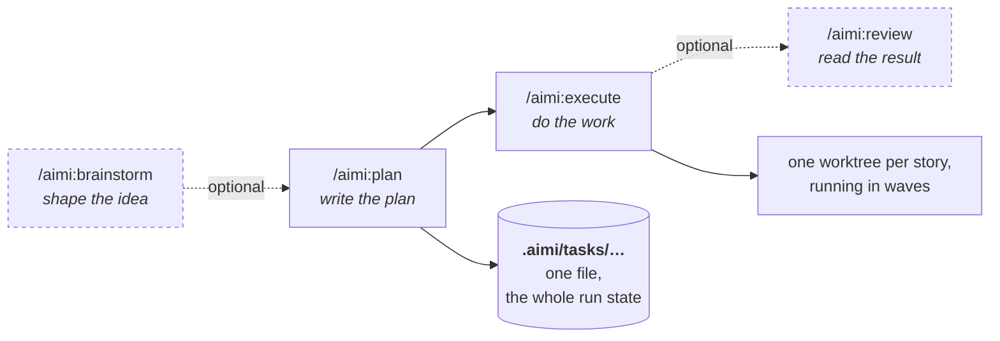
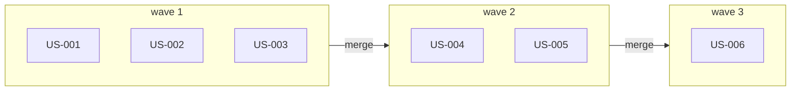
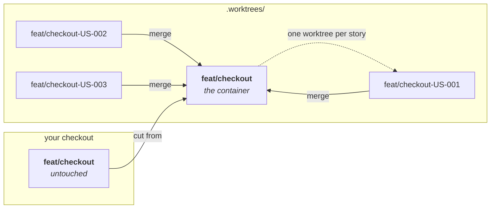
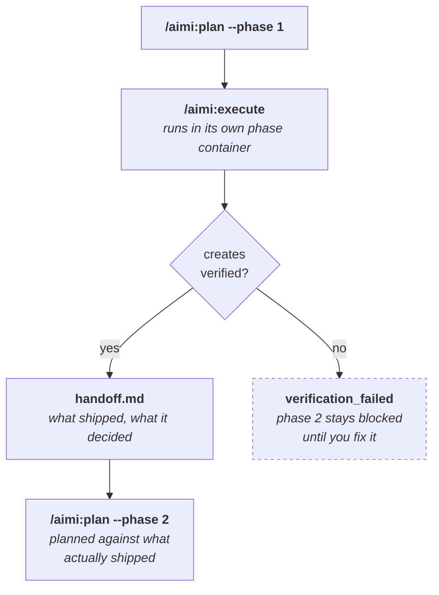

# Aimi Engineering

You describe what you want built. The plugin turns it into a plan, splits it into pieces that don't depend on each other, and runs them at the same time — each in its own isolated workspace, each with a fresh context.

At the end you review commits, not steps.

Works with [Claude Code](https://claude.com/claude-code) and [OpenCode](https://opencode.ai).

---

## Why this exists

A coding agent working straight through a feature keeps one context for the whole job. It fills up. By the third file the agent is carrying everything it read for the first two, and quality drops right when the work gets hardest.

This plugin changes the shape of that work:

- A feature becomes a **plan** — a set of stories, each small enough to finish in one context window.
- Stories that don't depend on each other run **in parallel**, each in its own git worktree.
- Each story gets a **fresh agent** that sees only that story. No leftovers from the last one.
- The whole run happens **outside your working tree**, so your checkout stays where you left it.
- Results merge back branch by branch, so a failure blocks only what depended on it.

You stay out of the loop until there is something to review.

---

## Install

### Claude Code

No dependencies. The plugin is self-contained.

```bash
claude /plugin marketplace add https://github.com/aimi-so/aimi-engineering-plugin
claude /plugin install aimi-engineering
```

Check it worked:

```bash
claude /plugin list
/aimi:init
```

### OpenCode

```bash
git clone https://github.com/aimi-so/aimi-engineering-plugin
cd aimi-engineering-plugin
./install.sh --to opencode
```

The installer rewrites commands, skills, and agents for OpenCode's structure. See [docs/opencode.md](docs/opencode.md) for what gets translated and the three features that behave differently there.

---

## The shape of a run



Only two of those are required. `/aimi:brainstorm` earns its place when you are still deciding what to build; `/aimi:review` when you want a second opinion before merging.

---

## First run

```bash
# 1. Work out what you're building (optional, but it makes the plan better)
/aimi:brainstorm Add user authentication with email and password

# 2. Turn it into a plan
/aimi:plan Add user authentication

# 3. Run it
/aimi:execute

# 4. Review what came out
/aimi:review
```

Step 2 writes `.aimi/tasks/YYYY-MM-DD-user-authentication-tasks.json`. That file is the whole state of the run — you can read it, edit it, and commit it.

Step 3 does the work. Watch or walk away.

---

## How the parallel part works

A plan is a graph, not a list. Stories with no unmet dependencies can start immediately; grouping by depth gives you **waves**.



Every story in a wave gets its own worktree and runs at the same time as its siblings. A wave merges into the feature branch before the next one starts, so a failure blocks only what depended on it.

Full detail in [docs/architecture.md](docs/architecture.md).

---

## Where the work happens

By default, `/aimi:execute` does not touch your working tree. Everything happens in worktrees under `.worktrees/`, nested two levels deep:



Your checkout stays where you left it, so you can keep working while a plan runs.

Two consequences worth knowing before your first run:

**Commit first.** A worktree branches from committed history — uncommitted edits do not reach it.

**Know what it branches from.** If the branch you are standing on carries work that is not yet merged into your default branch, the container is cut from *that* branch, so the run builds on top of it. If your checkout is clean relative to the default branch, it is cut from the default branch instead. Interactively you are asked which you want; unattended, it stacks and says so. Name it outright with `--base`:

```bash
/aimi:execute --base feat/checkout   # cut from this branch, no question asked
/aimi:execute --inline               # run against your working tree instead
```

Full behavior, teardown, and limitations: [docs/commands.md](docs/commands.md#container-mode-full-run).

---

## Work too big for one plan

When `/aimi:brainstorm` finds that what you described is more than one capability — say checkout *and* subscriptions — it proposes a **roadmap**: the feature cut into phases, each one demoable on its own.

You then plan and run one phase at a time, so phase 2 is planned with phase 1's actual outcome in hand rather than guessed at months earlier.

```bash
/aimi:plan --phase 1
/aimi:execute
/aimi:plan --phase 2
```

### How a phase closes

A phase does not close because its stories finished. It closes because what it promised was found in the code.



**What a phase declares.** Each one names its `creates` — the artifacts it will produce — and its `needs`, the ones it expects from earlier phases. That is what makes the graph checkable rather than aspirational.

**Creates verification** looks for each promised artifact among the files git tracks: a file or folder at that path, or the name in tracked source. Documentation, tests and to-do comments do not count — a name that appears only there says the work was *described*, not built. Only committed work is visible, so commit before you close.

**The handoff** is written only after verification passes, and the phase reaches `completed` only after the handoff is on disk. Its *Artifacts Created* section is matched verbatim when a later phase's `needs` is checked, so the wording carries weight.

Phases are claimed atomically, so two sessions can work different phases of one roadmap without colliding. A crashed session's claim is released on the next run.

Single-capability features never see any of this.

How the cut is decided, the on-disk layout, and what happens between phases: [docs/roadmaps.md](docs/roadmaps.md).

---

## Multiple repositories

`AIMI_ROOT` — the folder holding `.aimi/` — does not have to be a git repository itself. It can be a plain, non-git parent folder holding one git repository per subfolder instead, with `.aimi/` living in that parent rather than in any child repo. This **multi-repo** layout is the one [GitHub issue #73](https://github.com/aimi-so/aimi-engineering-plugin/issues/73) reported as unsupported — it is supported now.

`/aimi:execute`, including phase mode, routes every story by its own `project` field to the repository that owns it. One plan, one roadmap phase, one `handoff.md` — but one container, one branch, and one pull request per participating repository, never a single combined one.

More on the layout, and why the split falls exactly there: [docs/roadmaps.md](docs/roadmaps.md#multiple-repositories).

---

## Commands

| Command | What it does |
|---------|--------------|
| `/aimi:brainstorm` | Explore what to build, through guided questions |
| `/aimi:plan` | Turn a description into a tasks file |
| `/aimi:deepen` | Enrich an existing plan with research |
| `/aimi:status` | Show progress |
| `/aimi:next` | Run the next story, one at a time |
| `/aimi:execute` | Run everything autonomously |
| `/aimi:review` | Multi-agent code review |
| `/aimi:open-pr` | Open a pull request from the task branch |
| `/aimi:validate-bug` | Reproduce and confirm a bug report |
| `/aimi:init` | Prime the CLI path cache |
| `/aimi:setup-models` | Choose which model runs which agent category |
| `/aimi:learnings` | Triage friction the hooks recorded while you worked |

Each one in detail: [docs/commands.md](docs/commands.md).

The flags you are most likely to reach for, all on `/aimi:execute`:

| Flag | Effect |
|------|--------|
| `--base <branch>` | Cut the container from this branch, instead of asking or inferring |
| `--inline` | Run against your working tree rather than a container |
| `--container` | Force container mode when the plan is set to inline |
| `--phase <N>` | Run one phase of a roadmap |
| `--push` | Publish the branch to `origin` when the run completes |

---

## What's inside

| | Count | |
|---|---|---|
| Commands | 12 | Slash commands for each stage |
| Skills | 24 | Packaged conventions and workflows |
| Agents | 33 | 15 review, 8 workflow, 7 research, 2 design, 1 shared reference |

The full catalogue, with what each one is for: [docs/agents-and-skills.md](docs/agents-and-skills.md).

You can route each agent category to a different Claude model — research on one, review on another — with `/aimi:setup-models`.

---

## Documentation

| | |
|---|---|
| [Commands](docs/commands.md) | Every command, in detail |
| [Agents and skills](docs/agents-and-skills.md) | What each one does |
| [Task schema](docs/task-schema.md) | The tasks file format |
| [Architecture](docs/architecture.md) | Parallel execution, context handling, security |
| [Roadmaps](docs/roadmaps.md) | Phasing large features, and the contracts between phases |
| [OpenCode](docs/opencode.md) | Installing and running on OpenCode |
| [Troubleshooting](docs/troubleshooting.md) | When something goes wrong |

---

## Contributors

<a href="https://github.com/aimieacc"></a>
<a href="https://github.com/stanleytakamatsu"></a>
<a href="https://github.com/alexchastinet"></a>

Full history on the [contributors graph](https://github.com/aimi-so/aimi-engineering-plugin/graphs/contributors).

Contributions are welcome. Open an issue before starting anything substantial, so the direction can be agreed before the work.

---

## License

MIT
